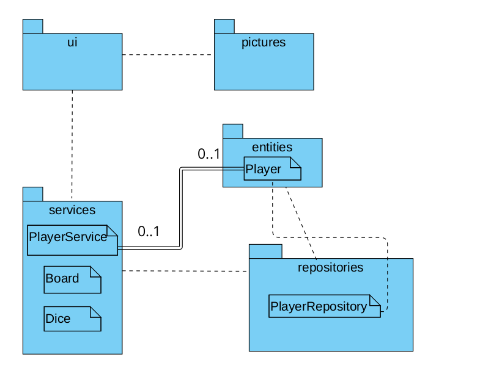
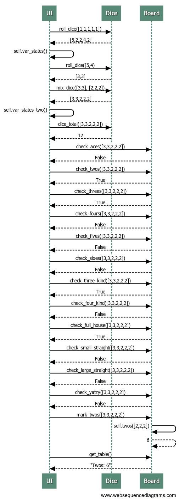

# Arkkitehtuurikuvaus

## Rakenne

## Tietojen pysyväistalletus

Pakkauksen repositories luokka PlayerRepository tallentaa tietoja SQLite-tietokantaan. Tietokanta pystytään helposti alustamaan käyttäjän erillisellä komennolla.

## Käyttöliittymä

Käyttöliittymässä on kuusi erilaista näkymää:

- Etusivu
- Pelaajanimen valinta
- Pelaajanimen luonti
- Pelitilanne
- Nopanheitto
- Pisteiden valinta

Jokainen näkymä on toteutettu omana luokkanaan ja näkymiä näytetään aina yksi kerrallan. UI-luokka vastaa näkymien näyttämisesti ui pakkauksessa. Käyttöliittymä on eriytetty sovelluslogiikasta.

## Sovelluslogiikka

Sovelluslogiikka toteutetaan luokissa Board, Dice ja PlayerService. Nämä kuvaavat pelaajien, pelilaudan ja noppien toiminnallisuutta.

## Päätoiminnallisuudet

Kuvattuna on sovelluksen toimintalogiikka nopanheittokierroksen osalta sekvenssikaaviona.

### Nopanheittokierros

Esimerkki siitä, miten nopanheittokierros toimii:

Pelaaja heittää ensin viittä noppaa kerran. Sen jälkeen hän valitsee, mitkä nopista haluaa pitää ja mitä heittää uudelleen. Pelaaja heittää haluamiaan noppia uudelleen. Uudelleen heitetyt nopat lisätään niihin noppiin, jotka ensimmäisellä kierroksella valittiin. Kaikista nopista pelaaja valitsee, mitä noppia hän haluaa käyttää pisteidenlaskussa. Sovelluslogiikkaa tarkistaa mitä mahdollisia vaihtoja pelaajalla on valitsemiensa noppien perusteella ja näyttää kyseiset vaihtoehdot. Pelaaja valitsee näistä yhden ja vaihtoehdon perusteella laskettavat pisteet kirjautuvat tauluun. Tämän jälkeen peli jatkuu uudella kierroksella.
