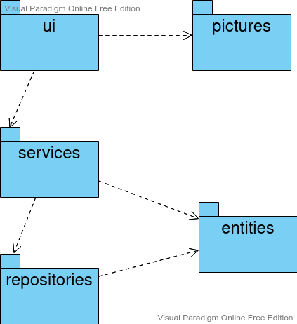
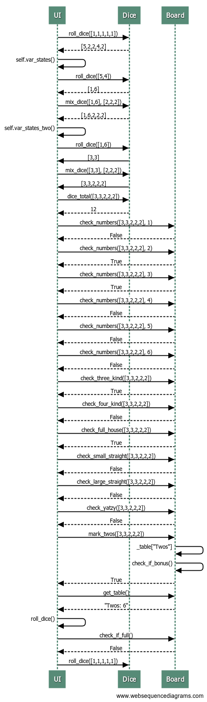
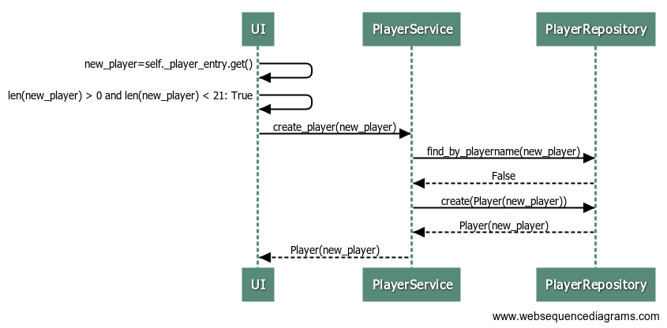

# Arkkitehtuurikuvaus

## Rakenne

Ohjelma on rakennettu perustuen kolmitasoiseen arkkitehtuuriin:

Yllä on kuvattu koodin pakkausrakenne.

Pakkauksia on siis kokonaisuudessaan viisi, joista suurimpina kokonaisuuksina pakkaukset _ui_ ja _services_: _ui_ sisältää käyttöliittymästä vastaavan koodin, kun taas _services_  sisältää varsinaisesta sovelluslogiikasta vastaavan koodin. 

Pakkaus _repositories_ sisältää tiedon pysyväistallennuksesta tietokantaan vastaavan koodin ja pakkaus _entities_ sisältää sovelluksen käyttämää tietokohdetta, pelaajaa, kuvaavan koodin.

Lisäksi on vielä pakkaus _pictures_, joka sisältää käyttöliittymään liittyvien kuvien säilytyksen.

## Käyttöliittymä

Pakkauksen _ui_ sisältämässä käyttöliittymässä on seitsemän erilaista näkymää:

- Etusivu [(IndexView)](../src/ui/index_view.py)
- Parhaat tulokset [(TopScoreView)](../src/ui/top_score_view.py)
- Pelaajanimen valinta [(ChoosePlayerView)](../src/ui/choose_player.py)
- Pelaajanimen luonti [(PlayersView)](../src/ui/players_view.py)
- Pelitilanne [(PlayView)](../src/ui/play_view.py)
- Nopanheitto [(DiceView)](../src/ui/dice_view.py)
- Pisteiden valinta [(BoardView)](../src/ui/board_view.py)

Jokainen näkymä on toteutettu omana luokkanaan, joiden nimet on mainittu sulkeissa. Näkymiä näytetään aina yksi kerrallan. Mainittujen lisäksi on olemassa [UI](../src/ui/ui.py)-luokka, joka vastaa eri näkymien näyttämisestä ja niihin vaihtamisesta. 

Näkymiin liittyvät toiminnallisuudet on toteutettu sovelluslogiikan pakkaukseen ja käyttöliittymä onkin kokonaan eriytetty sovelluslogiikasta.

## Sovelluslogiikka

Sovelluslogiikka toteutetaan siis pakkauksessa _services_ ja tarkemmin luokissa nimeltä [Dice](../src/services/dice.py), [Board](../src/services/board.py) ja [PlayerService](../src/services/player_service.py). Nimiensä mukaisesti luokat kuvaavat pelaajien, pelilaudan ja noppien toiminnallisuutta. Alle on kuvattu _services_ pakkauksen suhteet muihin pakkauksiin:

Luokkien käyttöliittymälle tarjoamia metodeja on paljon, ensimmäisten noppin heitosta eri noppayhdistelmien merkitsemiseen taululle. Esimerkkejä luokkien tarjoamista metodeista:

`Dice`:

- `roll_dice(dice)`
- `mix_dice(dice, selected_dice)`

`Board`:

- `check_numbers(dice_list, number)`
- `mark_full_house(new_sum)`

`PlayerService`:

- `create_player(playername)`
- `get_points_of_player(playername)`

`PlayerService` on siis yhteydessä pelaajiin liittyviin tietoihin  tietojen pysyväistallennuksesta vastaavan, pakkauksessa _repositories_ sijaitsevan, luokan `PlayerRepository` kautta.

## Tietojen pysyväistalletus

Pakkauksen _repositories_ luokka [PlayerRepository](../src/repositories/player_repository.py) tallentaa tietoja SQLite-tietokantaan, tauluun nimeltä `players`. Tietokantaan talletetaan pelaajanimet ja näihin liittyvät suurimmat pistetulokset. 
Tietokanta pystytään helposti alustamaan käyttäjän erillisellä komennolla ja tietokannan nimi on konfiguroitavissa ohjelman juuritiedossa sijaitsevassa konfiguraatiotiedostossa nimeltä [.env](https://github.com/johyy/ot-harjoitustyo/blob/master/yatzy-app/.env).

## Päätoiminnallisuudet

Kuvataan sovelluksen toimintalogiikkaa nopanheittokierroksen sekä uuden pelaajanimen lisäämisen osalta sekvenssikaavioina:

### Nopanheittokierros

Esimerkki siitä, miten nopanheittokierros toimii:

Pelaaja heittää ensin viittä noppaa kerran. Sen jälkeen hän valitsee, mitkä nopista haluaa pitää ja mitä heittää uudelleen. Pelaaja heittää haluamiaan noppia uudelleen. Uudelleen heitetyt nopat lisätään niihin noppiin, jotka ensimmäisellä kierroksella valittiin. 
Näistä nopista pelaaja valitsee jälleen, mitkä haluaa säästää. Loput nopat heitetään uudestaan ja sitten valitut sekä uudestaan heitetyt nopat yhdistetään.

Sovelluslogiikkaa tarkistaa mitä mahdollisia vaihtoja pelaajalla on valitsemiensa noppien perusteella ja näyttää kyseiset vaihtoehdot. Pelaaja valitsee näistä yhden ja vaihtoehdon perusteella laskettavat pisteet kirjautuvat tauluun.

Tämän jälkeen pelaaja jatkaa peliä uudella heittokierroksella, jolloin ohjelma tarkistaa, onko tulostaulu täynnä, vai voiko peli jatkua. Jos tulostaulu ei ole täynnä, jatkuu peli uudella noppien heittokierroksella.

### Pelaajanimen lisääminen

Pelaaja kirjottaa nimen siihen tarkoitettuun kohtaan, josta ohjelma sen nappaa. Käyttöliittymä tarkistaa, että nimi on oikean pituinen ja lähettää sen sitten eteenpäin sovelluslogiikalle. 

Sovelluslogiikka tarkistuttaa, ettei nimi ole jo valmiiksi tietokannassa. Mikäli näin ei ole, luodaan `Player`-olio ja lisätään siihen liittyvä nimi ja pisteet (alussa 0) tietokantaan.

Käyttöliittymä saa palautuksena `Player`-olion, kun uusi pelaaja on luotu.

### Muut toiminnallisuudet

Sovellus toimii graafisen käyttöliittymän pyyntöjen mukaan kutsumalla tilanteeseen sopivaa sovelluslogiikan metodia. Kyseinen metodi joko edistää sovelluslogiikan pelitapahtumia ja palauttaa kontrollin käyttöliittymään, tai muuttaa pelaajan tietoja sekä palauttaa kontrollin käyttöliittymään.
