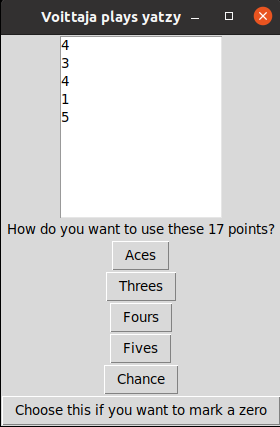
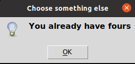

# Käyttöohje

Pelin lähdekoodi löytyy sen tuoreimmasta [releasesta](https://github.com/johyy/ot-harjoitustyo/releases), valitsemalla _Assets_ -kohdan alta _Source code_.

## Ohjelman käynnistäminen

Poetryn riippuvuudet saadaan asennettua komennolla:

```bash
poetry install
```

Ohjelman tietokannan saa alustettua komennolla:


```bash
poetry run invoke build
```

Itse peli käynnistyy komennolla: 


```bash
poetry run invoke start
```

## Aloitus

Peli käynnistyy aloitusikkunaan:


Pelaajanimien parhaimpia tuloksia pääsee katselemaan painikkeella "Top Score". Peli aloitetaan painamalla "Play"-painiketta.

## Pelaajanimen lisääminen

Peli siirtyy näkymään, jossa on mahdollista valita pelaajanimi listalta tai lisätä uusi pelaajanimi painamalla painiketta "Add a new player":


Uusi pelaajanimi kirjoitetaan lisäysriville seuraavassa näytössä. Painamalla jälleen "Add a new player"-painiketta pelaajanimi lisätään pelaajanimien listalle. Paluu edelliseen valintanäyttöön tapahtuu painikkeella "Return":


Nyt pelaajanimi löytyy listalta ja voidaan valita. Peliin päästään painikkeella "Play!":


## Pelaaminen

Peli aloitetaan heittämällä noppia "ROLL DICE"-painikkeella:


Ensimmäisen kierroksen nopat tulevat seuraavaan näkymään. Näistä valitaan ne nopat, jotka halutaan säästää, loput nopista heitetään uudelleen. Kuittaus valituista nopista tehdään painikkeella "I have chosen!":


Nopat heitetään uudelleen ja seuraavassa näkymässä valitaan jälleen säästettävät nopat:


"Ready!"-painikkeella siirrytään seuraavaan näkymään, jossa näkyvät vielä kerran heitetyt nopat. Peli näyttää automaattisesti ne kohdat pistetaulukosta, joita valituilla nopilla on mahdollista valita:



Jos yritetään valita sellainen kohta pistetaulukosta, joka on jo aiemmin täytetty, tulee seuraavanlainen ilmoitus:



Tällöin kannattaa painaa painiketta "Choose this if you want to mark a zero", joka avaa kaikki pistetaulukon kohdat. Näistä voidaan valita tyhjä kohta, joka vaihdetaan nollaksi. Edelleen on myös mahdollista valita joku kohta, johon pisteitä käyttää, jos sellaisia on vielä vapaana:


Pistetilanne avautuu seuraavaan näkymään ja päivittää itseään jokaisen kierroksen jälkeen. Peli lisää automaattisesti bonuksen (50 pistettä), jonka saa, mikäli ensimmäisistä kuudesta kohdasta saa yli 63 pistettä. "Continue"-painikkeesta pääsee heittämään noppia seuraavalle kierrokselle:


Kun kaikki kohdat on täytetty ja peli loppuu, tulee ilmoitus, mikäli pistemäärä on uusi ennätys pelaavalle pelaajanimelle. Mikäli ennätystä ei synny, ilmoittaa sovellus ainoastaan lopullisen pistemäärän ja ohjaa pelaajaa sulkemaan pelin.
