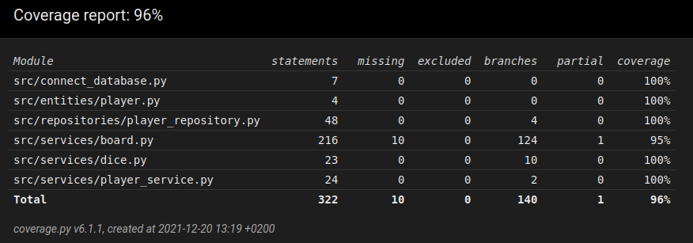

# Testausdokumentti

Ohjelmaa on testattu sekä manuaalisesti järjestelmätasossa, että automatisoidusti unittestilla yksikkö- ja integraatiotasossa.

## Yksikkö- ja integraatiotestaus

### Sovelluslogiikka

Pelin sovelluslogiikasta vastaavia luokkia `Dice`, `Board` ja `PlayerService` testataan [ServiceTest](https://github.com/johyy/ot-harjoitustyo/blob/master/yatzy-app/src/tests/service_test.py)-hakemiston alla testiluokilla `TestDice`, `TestBoard` ja `TestPlayerService`.

### Repositorio

`PlayerRepository`-luokkaa testataan [TestPlayerRepository](https://github.com/johyy/ot-harjoitustyo/blob/master/yatzy-app/src/tests/repository_test.py)-testiluokalla. Testiluokalla on omassa käytössä oleva tietokantatiedosto, jonka  nimi on konfiguroitu _.env.test_-tiedostoon.

### Entiteetti

`Player`-luokan testaus tapahtuu [TestPlayer](https://github.com/johyy/ot-harjoitustyo/blob/master/yatzy-app/src/tests/entity_test.py)-testiluokalla.

### Testauskattavuus

Testauskattavuudesta on jätetty pois käyttöliittymätaso, sekä build.py- ja initialize_database.py-tiedostot.

Testauksen haarautumakattavuudeksi saatiin lopulta siis 96%. Automatisoidusta testauksesta jäi uupumaan pelilaudan muutama tulostauluun liittyvää metodia, jotka on testattu manuaalisesti.

## Järjestelmätestaus

Kuten todettu, sovelluksen järjestelmätestaus on toteutettu manuaalisesti.

### Asennus

Sovelluksen asennus on testattu [käyttöohjeen](https://github.com/johyy/ot-harjoitustyo/blob/master/yatzy-app/dokumentaatio/kayttoohje.md) perusteella Linux-ympäristöön sekä paikallisella, että etätyöpöydällä.

Sovellusta on testattu sekä valmiiden pelaajanimien kanssa, että ilman valmiita pelaajanimiä.

### Toiminnallisuudet

Kaikki [käyttöohjeessa](https://github.com/johyy/ot-harjoitustyo/blob/master/yatzy-app/dokumentaatio/kayttoohje.md) ja [vaatimusmäärittelyssä](https://github.com/johyy/ot-harjoitustyo/blob/master/yatzy-app/dokumentaatio/vaatimusmaarittely.md) mainitut toiminnallisuudet on testattu toimiviksi. Pelaajanimen lisäyksen yhteydessä on testattu myös tyhjän pelaajanimen, liian pitkän pelaajanimen ja jo tietokannasta löytyvän pelaajanimen lisäystä.
